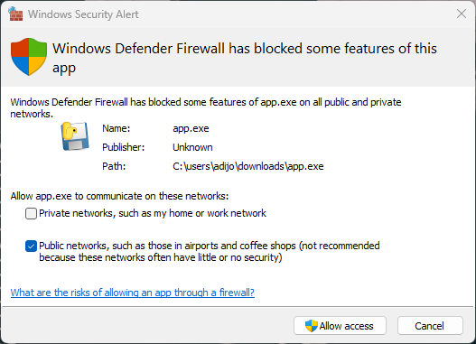

# river

This just sets up a silent Amazon data scraper with Firefox and Selenium and runs under a WebSocket API.

It's very simple, and it's just for some stuff that I'm doing

## Building locally

```bash
python -m pip install --upgrade pip
pip install -r requirements.txt
pyi-makespec main.py --onefile --noconsole
pyinstaller --clean main.spec
```

Check `dist/` for an executable. Running the EXE should start the server on `ws://localhost:8001`

## Usage

Connect to the server using any WebSocket client and send any of the following commands as objects:

```json
{
    command: "login"
    username: string
    password: string
}
```

```json
{
    command: "scrape"
    asin: string
}
```

```py
from websockets.sync.client import connect
import json
with connect("ws://localhost:8001", max_size=None) as websocket:
    websocket.send(
        json.dumps(
            {
                command: "login"
                username: "john@doe.com"
                password: "??sEcret_!04$"
            }
        )
    )
    ...
```

## Possible errors

On Windows, you might get this error:

```text
OSError: [Errno 10048] error while attempting to bind on address ('0.0.0.0', 8001): only one usage of each socket address (protocol/network address/port) is normally permitted
```

even though the server has not been started already. To solve this, make sure you give the app permissions to access features on public/private networks:

> 
